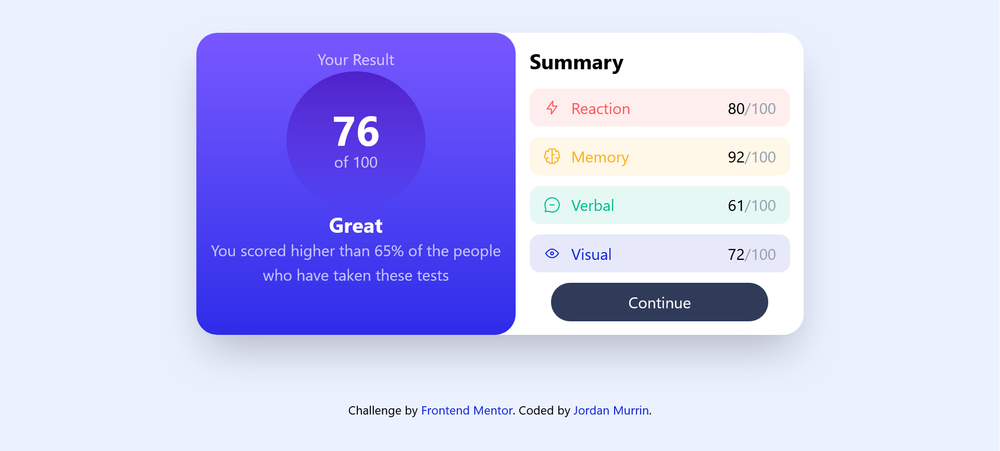

# Frontend Mentor - Results summary component solution

This is a solution to the [Results summary component challenge on Frontend Mentor](https://www.frontendmentor.io/challenges/results-summary-component-CE_K6s0maV). Frontend Mentor challenges help you improve your coding skills by building realistic projects. 

## Table of contents

- [Overview](#overview)
  - [The challenge](#the-challenge)
  - [Screenshot](#screenshot)
  - [Links](#links)
- [My process](#my-process)
  - [Built with](#built-with)
  - [What I learned](#what-i-learned)
  - [Continued development](#continued-development)
  - [Useful resources](#useful-resources)
- [Author](#author)
- [Acknowledgments](#acknowledgments)

## Overview

### The challenge
This is a re-do of a previous project. I did it once with vanilla HTML, CSS. Next I did it in Tailwind CSS. This time I wanted to add javascript to the mix in order to fetch the data from the data.json file.

### Screenshot

### Links

- Solution URL: [Add solution URL here](https://www.frontendmentor.io/solutions/results-summary-using-tailwind-css-and-javascript-fetch-api-VrMimJoEe7)
- Live Site URL: [https://results-summary-json.netlify.app/])

## My process

### Built with

- Semantic HTML5 markup
- CSS custom properties
- Flexbox
- CSS Grid
- Mobile-first workflow
- [Tailwind CSS](https://tailwindcss.com/docs/installation/tailwind-cli) - CSS framework

### What I learned

- First I marked up the page and added Tailwind CSS v4. This required me to review how to add locally hosted fonts into Tailwind. Used @font-face, then created a CSS variable to use in my Tailwind @theme. I also learned how Tailwind does gradients.

- Once I had created a static site to my liking, it was time to add the javascript. I researched the fetch method, and got it to work. Then I found an alternate way to read data from json that made a lot of sense. [Mazen Salah](https://www.youtube.com/watch?v=w1Oz0Sj1QyQ)"How to read data from a JSON file into HTML | json to html js 2024"

- The biggest challenge was how to style the list-items dynamically. Each category has its own color scheme. I solved this by adding the background-color and text-color to the json file. I learned how to load an icon dynamically in javascript in Tailwind.

### Continued development

The site looks great in live server; now I have to figure out how to build it for production

### Useful resources

- [Bytegrad Display data from json in html](https://www.example.com](https://www.youtube.com/watch?v=Oage6H4GX2o) - This helped me for to clean up my javascript. I really liked this pattern and will use it going forward.

## Author

- Frontend Mentor - [@beowulf1958](https://www.frontendmentor.io/profile/beowulf1958)

## Acknowledgments

Thank you to @lemz100 for the inspiration to calculate the average of the scores in javascript and display in HTML. Genius move.

